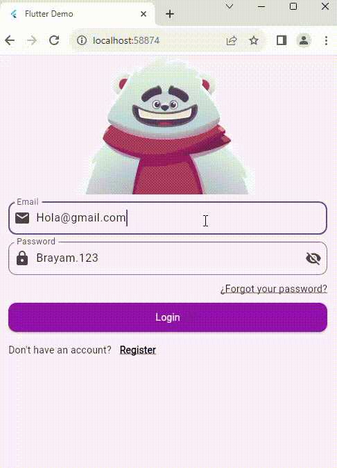

# flutter_with_animation

In this project, we will create a login screen accompanied by an animated bear 🐻,
which will interact with the user in the following ways:
1) When we type our email, the bear will follow us with its gaze 👀
2) When we type in the password field, the bear will cover its eyes 🙈
3) When we type the password incorrectly, the bear will get scared 😨
4) When we type the password correctly, the bear will celebrate 🥳

## Rive🎨
Rive is a real-time interactive animation tool. It allows you to create, animate, and control vector graphics that can react to user interaction or the state of an application.
It is widely used in Flutter, Unity, React, Android, iOS, and others, for animations such as:
1) Characters that move or change expressions.🦸🏻
2) Buttons with effects when pressed. 🔘
3) Animated logos. ✨
4) Smooth transitions within apps or games.🎮

Unlike a simple GIF or video, Rive animations are interactive and lightweight, as they are rendered in real time with code.

## State Machine⚙️
A State Machine in Rive is the system that allows you to control the logic of how and when animations change.
Instead of just playing an animation from start to finish, a state machine can:
1) Switch between animations based on inputs.
2) React to user events or program variables.

## Technologies🧠
1) Flutter – Main framework for building the app 🪽
2) Dart – Programming language used 💻
3) Rive – Tool for creating and integrating interactive animations 🎨
4) State Machine – Used to control animation states in Rive ⚙️
5) VS Code – Development environment 🧰

## Basic structure of the project
1) assets/ – Stores the animation resources used in the project 📁
2) lib/ – Main source folder that contains all the core app files. 📁
3) Screens/ – Holds the app’s screens. In this case 📁: 
4) login_screen.dart: Includes the primary functionality and UI code. 📄
5) main.dart: Responsible for initializing and launching the Flutter app. 📄
6) pubspec.yaml – Configuration file where dependencies, assets, and metadata of the project are declared. It manages package imports and asset linking. 📦

## Demo 🎬

  

Rive animation used in this project: https://rive.app/marketplace/3645-7621-remix-of-login-machine/

## Subject Data💾
Name of the subject: Graphing🖥️

Teacher´s Name: Rodrigo Fidel Gaxiola Sosa👨🏻‍🏫
